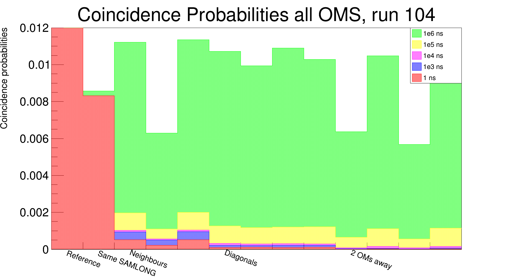

======================
The ``2Dto1D`` program
======================

2Dto1D is a ROOT macro used to rearrange the coincidence probability TH2D into a TH1D where the x axis represent the distance to the reference cube.

Example :

The work is performed for the different coincidence windows given at the beginning and for every OM.
Output probabilities are in % and the reference OM value is set to 1.

Each bin in the final TH1D correspond to a certain distance to the reference OM :

| bin 0 : the reference OM
| bin 1 : the OM on the same SAMLONG (above or below)
| bin 2 to 4 : 3 other closest neighbours
| bin 5 to 8 : 4 OMs directly diagonal to the reference one
| bin 9 12 : 4 OMs that are 2 OMs away from the reference one

plot1D.cxx
----------

A ROOT macro used to actually plot the result for a specified OM (12.5 in the current code).

sum1D.cxx
---------

A ROOT macro used to create a new file containing the sum of all OM's probability TH1D for each coincidence window (except the 2 outside rows and columns).
This is done to lower statistical effect to better see if the coincidence probability is really linked to the distance to the reference OM.

plotSum.cxx
-----------

A ROOT macro used to plot the summed probability for difference coincidence windows (see image).

