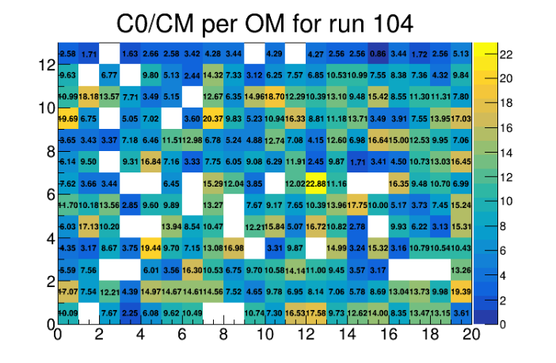
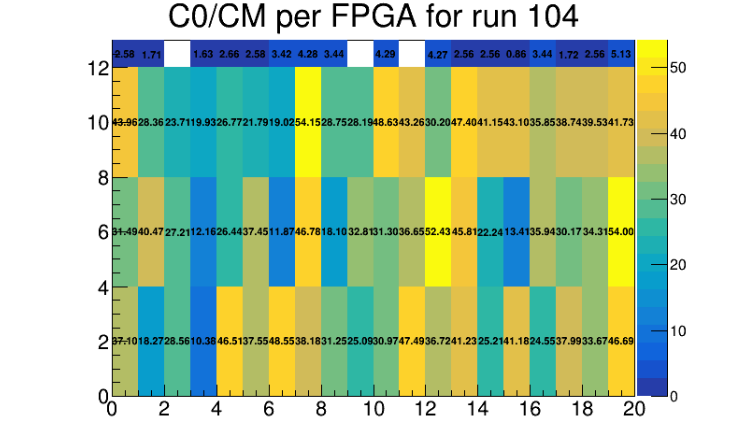

========================
The ``C0CM.cxx`` program
========================

.. contents::

--------

Usage
=====

The ``C0CM.cxx`` program is a ROOT macro.

The input and output files are defined in the code.

It was designed to check the physical or electronical nature of the high number of events in the
beginning of each runs (before we knew about the buffer memory)

Running
=======

``C0CM.cxx`` will look at every entry in the input ROOT tree and will store events in two arrays
where each elements correspond to an optical module of the main wall

> hit_start[260] contains events coming in the first 50 ms of the run

> hit_end[260]   contains events coming in the rest of the run

Then it will compute, per OM, the ratio :

> Trigger rate in the first 50 ms over Trigger rate in the rest of the run

And plot 2 TH2D, one per OM, one per FPGA :

