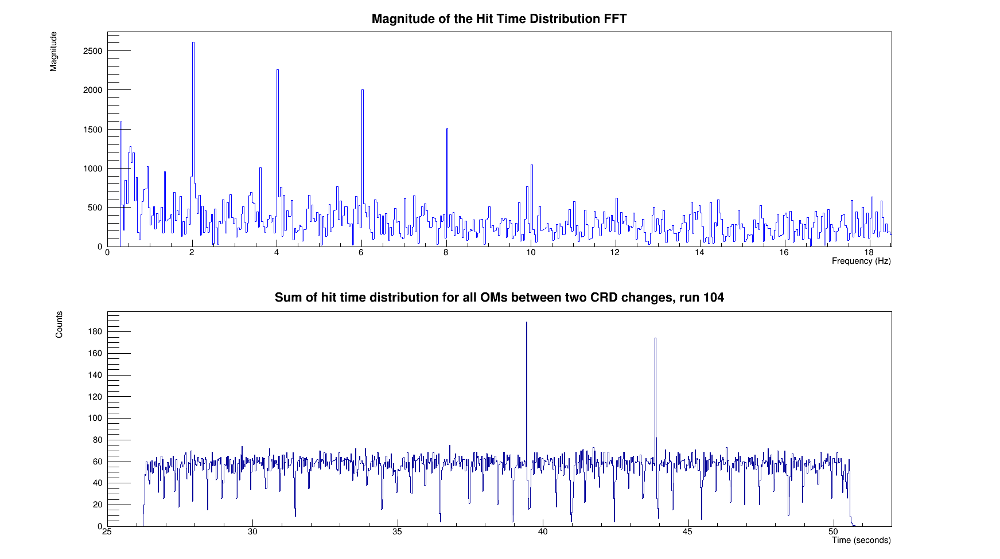

===================
The ``FFT`` program
===================

Is used to perform the Fast Fourier Transform of the hit time distribution given by the ``src/TimeDistrib.cxx`` program in the same folder (see below).

It uses the FFT algorithm of the ROOT framework and output the following results :

FFT/src/TimeDistrib.cxx
-----------------------

Works in the same way as ``TimeDistrib/src/TimeDistrib.cxx`` but with limited range and specified binning so FFT.cxx has an increased range in frequency.
