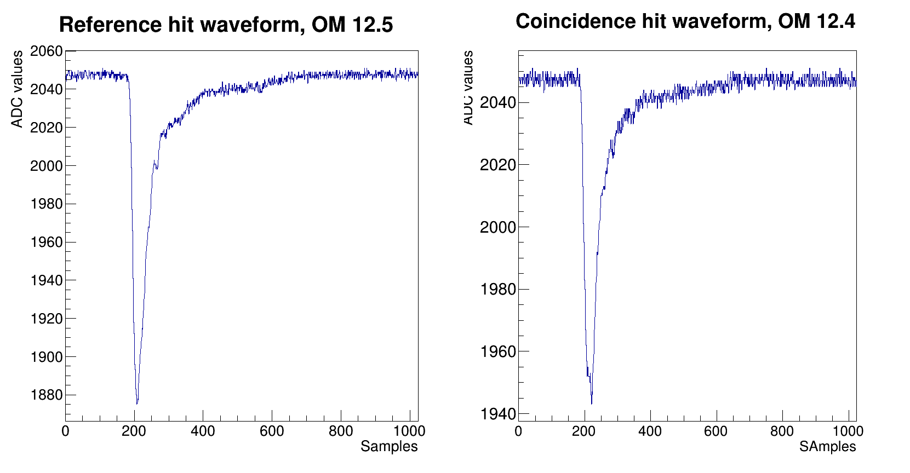

=============================
The ``plotCoincSaml`` program
=============================

ROOT macro used to plot the same SAMLONG coincidences waveforms.

Given the hit_list outputed by CoincSaml.cxx, the program works as follow.

Let's say we have the following list :

| ########### 12.5 ############
| 3466      // reference hit number
| 32456     // coincidence hit number
| 75888     // another coincidence hit number

The program will first create a ROOT directory called **ref_cube_12.5** in the ROOT output file.
Then for every coincidence hit, it will plot side by side the reference hit and the coincidence hit like the following :

