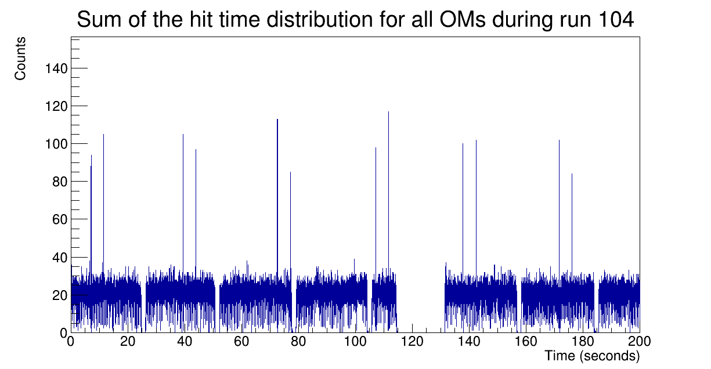

===========================
The ``TimeDistrib`` program
===========================

Given a sorted ROOT tree, will output a TH1D with the hit time distribution of all events in a run,
the distribution is in seconds and we set 100 bins per seconds (FFT range dependes on this binning)

here a zoom of the first 200 seconds of run 104
